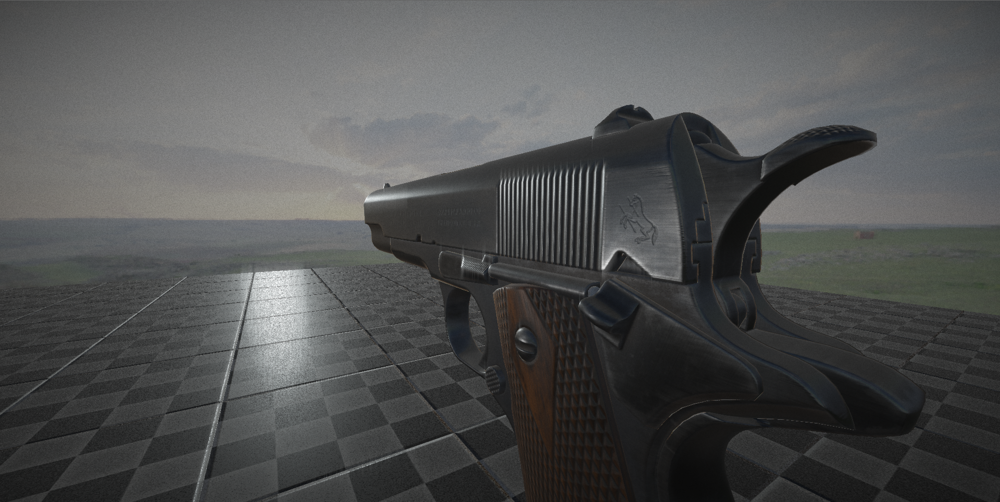

# Insight Engine
Game engine written in C/C++ with DirectX 11/12graphics API support.  

**World Editor**
* Quickly update the transforms and components of your objects in real-time without having to close the engine and make adjustments. ImGui being used to provide quick window docking display information for Game Objects

**Physically-Based Rendering with Image-Based Lighting**
* Retina uses a full PBR pipeline for materials. Albedo, Normal, Roughness, Metallic, and Ambient Occlusion maps are all put to use to produce very realistic Surfaces. Specular Image-Based Lighting (IBL) is also used to ground the objects in the scene

**C-Sharp Scripting**
* C-Sharp allows for quick modification to a Game Actos's behavior in the scene simply add a new C-Sharp Script Component and get your objects interacting with each other.

**JSON File IO**
* Save and load your scenes. In the background, JSON is being used to store all Game Objects and their corresponding components

### Editor

### PBR

**Platforms**
* Windows PC Desktop (x64)
* Windows 10 Version 1809 if running DXR
* Visual Studio 2019/*2017

**Getting Started**
1) Clone the repo into a directory with "git clone --recurse-submodules".
2) Navigate to InsightEngine
3) Run the "Dependency_Build_Scripts/Win_Build_Dependencies.bat" file to build all dependencies.
4) Run all intallers under Vendor/Redist. Download and install the mono runtime for C-Sharp scripting at "https://www.mono-project.com/download/stable/". Once intalled, navigate to the install diretory, usually in "C:/Program Files/Mono" and copy the Mono folder and past it into "Engine/Vendor". This step is to keep file sizes low for GitHub
5) Run "Project_Build_Scripts/Win_Gen_Projects_VS2019.bat" to generate the Visual Studio Project files. Note: Visual Studio 2017 is supported, however, you must change the Visual Studio location to Visual Studio 2017 in "Win_Gen_Projects_VS2019.bat" and all scripts in "Project_Build_Scripts/" and "Dependency_Build_Scripts" as this script searches for your local Visual Studio command line executable to build dependency binaries.
6) Open the generated Visual Studio solution and enjoy. You dont need to worry about copying dependency binaries to the output directory, post project build steps will achieve this for you. 

Note: You must have a Insight project in your documents folder with a path of "Documents/Insight Projects/" to launch the engine. A development project can be found at "https://github.com/GCourtney27/Insight-Dev-Project"
